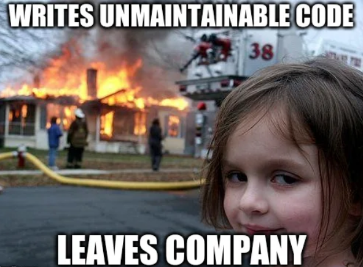

# Never have an unmaintanable Jupyter Notebook again!

## 1. Motivation: why use Jupyter Notebooks

## 2. Challenges around Jupyter Notebook maitainability

### 2.1 Code editor support

### 2.2 Version control

### 2.3 Code quality tools

## 3. A workflow for maintainable Jupyter Notebooks
