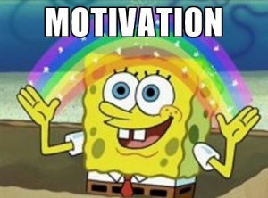

# Motivation

## We'll load in four datasets:

- ### `data/dataset_0.csv`

- ### `data/dataset_1.csv`

- ### `data/dataset_2.csv`

- ### `data/dataset_3.csv`

## Each has two columns: `x` and `y`.

## We'll then:

- ### load data, print summary statistics (`pandas`);

- ### fit a linear regression model (`scikit-learn.linear_model`);

- ### print mean squared error (`scikit-learn.metrics`).
